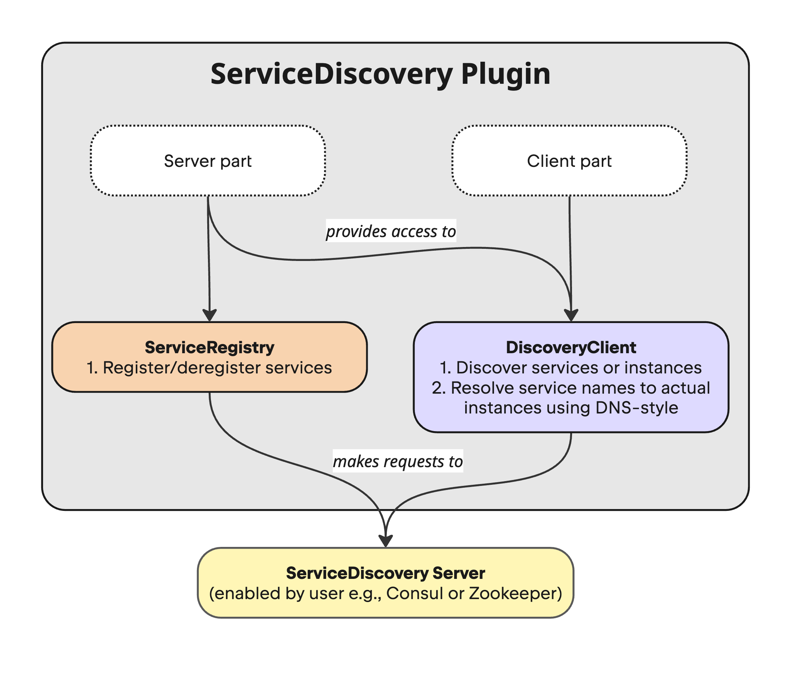

|             |                                                                                          |
|-------------|------------------------------------------------------------------------------------------|
| Feature     | Service Discovery                                                                        |
| Submitted   | 2025-04-22                                                                               |
| Accepted    | No                                                                                       |
| Issue       | [KTOR-6023](https://youtrack.jetbrains.com/issue/KTOR-6023/Add-Service-Discovery-Plugin) |

### Contents

1. [Summary](#summary)
2. [Motivation](#motivation)
3. [Current Solutions](#current-solutions)
4. [Design Overview](#design-overview)
5. [Design Details](#design-details)
6. [Drawbacks](#drawbacks)
7. [Advantages](#advantages)
8. [Future Directions](#future-directions)

<hr />

# Summary
[summary]: #summary

This proposal introduces a Service Discovery plugin for Ktor that enables applications to dynamically 
locate and communicate with services in distributed environments. The plugin provides a unified abstraction layer 
over popular discovery mechanisms ([Consul](https://developer.hashicorp.com/consul), 
[Kubernetes](https://kubernetes.io/), [Eureka](https://github.com/Netflix/eureka/wiki), 
[Zookeeper](https://zookeeper.apache.org/)) while offering both client-side 
and server-side discovery patterns. This allows Ktor applications to automatically register themselves with 
service registries and discover other services without hardcoded configurations, making them more resilient 
and adaptable to dynamic infrastructure changes.

# Motivation
[motivation]: #motivationД

Microservices typically run in distributed environments like containers ([Docker](https://www.docker.com/)) 
or orchestrators ([Kubernetes](https://kubernetes.io/)), where services are constantly scaling up and down based on demand. 

**Service discovery** is a component in modern distributed systems, enabling services to dynamically locate and communicate with each other 
without hardcoded configurations. The number of instances of a service and its locations change dynamically. 
We need to know where these instances are and their names to allow requests to arrive at the target microservice. 
The Service Discovery mechanism helps us know where each instance is located.
The following are reasons why service discovery is important:
1. **Dynamic Environments:** services may be added, removed, or relocated dynamically, and maintaining a static list of IP addresses is impractical.
2. **Scaling:** services may scale horizontally. One microservice could have multiple instances, and clients need to know which instance to contact.
3. **Fault Tolerance:** services may fail or be restarted, and service discovery ensures that clients are always directed to healthy instances.
4. **Decoupling Services:** service discovery helps in decoupling services, as it removes the need to hard-code dependencies between them
5. **Load Balancing:** service discovery works hand-in-hand with load balancers to distribute requests evenly across service instances.


# Current Solutions
[current-solutions]: #current-solutions

## 1. Manual Configuration
Many Ktor applications rely on manual configuration:
```kotlin
val config = ApplicationConfig("application.conf")
val serviceUrl = config.property("services.other-service.url").getString()
val client = HttpClient() 
val response = client.get("$serviceUrl/other")
```

**Limitations:**
* Requires manual updates when service locations change
* Complex deployment procedures to update configurations
* Lack of runtime adaptability to service changes
* No automatic failover when services become unavailable

## 2. Using External Libraries
### 2.1. Consul
[Consul](https://developer.hashicorp.com/consul) is an open-source tool developed by Hashicorp that provides service discovery, health checking, 
key-value storage, and multi-datacenter support.

#### Workflow
1. Registration: User adds services to the Consul catalog, which is a central registry that lets services automatically 
discover each other without requiring a human operator to modify application code, deploy additional load balancers, 
or hardcode IP addresses. Services can also include health checks so that Consul can monitor for unhealthy services.
2. Discovery: Consul's identity-based DNS system locates healthy services within the catalog. 
Registered services provide health metrics, access endpoints, and metadata to optimize network traffic management. 
Services communicate exclusively through their local proxies according to defined identity-based policies.

#### Implementation Process
1. User needs to launch a Consul server
2. Then define services and associated health checks
3. Register these definitions with a Consul agent
4. Enable network services to locate each other via DNS using static or dynamic lookups

[Consul Client Libraries](https://developer.hashicorp.com/consul/api-docs/libraries-and-sdks) are available to simplify interactions with the Consul server API, 
abstracting the underlying communication processes:
1. [consul-api](https://github.com/Ecwid/consul-api) \
Java client for [Consul HTTP API](http://consul.io), it supports all [API endpoints](http://www.consul.io/docs/agent/http.html), 
all consistency modes and parameters (tags, datacenters etc.)

   ```kotlin
   val consulClient = ConsulClient("localhost", 8500)
   
   val service = NewService().apply {
      id = "simple-ktor-service-123"
      name = "simple-ktor-service"
      address = "localhost"
      port = 8080
      tags = listOf("ktor")
      check = NewService.Check().apply {
          http = "http://localhost:8080/health"
          interval = "15s"
          timeout = "5s"
      }
   }
   
   // Register the service
   consulClient.agentServiceRegister(service)
   
   // Discover services
   val response = consulClient.getCatalogService(serviceName, CatalogServiceRequest.newBuilder().build())
   ```
2. [consul-client](https://github.com/rickfast/consul-client/tree/master) \
   Java Client for Consul HTTP API

   ```kotlin
   val client = Consul.builder().build()
   val agentClient = client.agentClient()
   
   val serviceId = "1"
   val service = ImmutableRegistration.builder()
       .id(serviceId)
       .name("myService")
       .port(8080)
       .check(Registration.RegCheck.ttl(3L))
       .tags(Collections.singletonList("tag1"))
       .meta(Collections.singletonMap("version", "1.0"))
       .build()
   
   agentClient.register(service)
   agentClient.pass(serviceId)
   
   val healthClient = client.healthClient()
   val nodes = healthClient.getHealthyServiceInstances("myService").getResponse()
   ```

### 2.2. ZooKeeper
[Apache ZooKeeper](https://zookeeper.apache.org/) is a centralized service for maintaining configuration information, 
naming, providing distributed synchronization, and providing group services.

#### Workflow:
1. Registration: Service instances register themselves with ZooKeeper by creating ephemeral znodes (data nodes) 
in a predetermined path structure. These znodes contain service metadata including host, port, and protocol information. 
The ephemeral nature ensures that nodes automatically disappear when a service instance goes down.
2. Discovery: Client applications connect to ZooKeeper and query for available service instances by looking up 
specific paths in the ZooKeeper hierarchy. ZooKeeper provides a hierarchical namespace similar to a file system, 
allowing services to be organized logically.
3. Monitoring: ZooKeeper maintains session information with each connected client through heartbeat messages. 
If a client fails to respond within the session timeout, ZooKeeper automatically removes the client's ephemeral nodes, 
effectively deregistering unavailable services.
4. Configuration Management: Beyond simple service discovery, ZooKeeper can store and distribute configuration data 
across all service instances, enabling runtime configuration changes without service restarts.

#### Implementation Process
1. User needs to set up a ZooKeeper ensemble (cluster)
2. Define a hierarchical path structure for services
3. Configure services to register themselves by creating ephemeral znodes
4. Implement watchers in client applications to receive notifications about service changes

[ZooKeeper Client Libraries](https://cwiki.apache.org/confluence/display/ZOOKEEPER/ZKClientBindings):
1. [Apache Curator](https://curator.apache.org/) \
   Apache Curator is a Java/JVM client library for Apache ZooKeeper, a distributed coordination service. 
   It includes a high-level API framework and utilities to make using Apache ZooKeeper much easier and more reliable.
   ```kotlin
   val client = CuratorFrameworkFactory.newClient("localhost:2181")
   client.start()
   
   val serviceDiscovery = ServiceDiscoveryBuilder.builder(ServiceDetails::class.java)
      .client(client)
      .basePath("/services")
      .serializer(JsonInstanceSerializer(ServiceDetails::class.java))
      .build()
   serviceDiscovery.start()
   
   val serviceInstance = ServiceInstance.builder<ServiceDetails>()
      .name("simple-ktor-service")
      .id("simple-ktor-service-123")
      .address("localhost")
      .port(8080)
      .payload(ServiceDetails("ktor"))
      .build()
   serviceDiscovery.registerService(serviceInstance)
   
   val provider = serviceDiscovery.serviceProviderBuilder()
      .serviceName("simple-ktor-service")
      .build()
   provider.start()
   
   val instances = provider.allInstances
   ```
   
### 2.3. Kubernetes
[Kubernetes](https://kubernetes.io/) is an open-source container orchestration platform that provides 
built-in service discovery as part of its core functionality. It enables automatic detection of services 
within a cluster through its Service resource type and DNS-based discovery.

#### Workflow:
1. Registration: Service registration in Kubernetes happens implicitly when users create Service resources 
that select pods using label selectors. Kubernetes automatically maintains the mapping between services 
and their underlying pods, even as pods are created, terminated, or scaled.
2. Discovery: Kubernetes provides two primary methods for service discovery:
   - Environment variables: Kubernetes injects service information into pods as environment variables.
   - DNS: Kubernetes runs a DNS server (CoreDNS) that maps service names to cluster IPs, allowing applications to find services using standard DNS queries.
3. Load Balancing: Kubernetes Services act as internal load balancers that distribute traffic across all matching pods. 
This built-in load balancing ensures even distribution of requests without additional configuration.
4. Health Checking: Kubernetes continuously monitors pod health through liveness and readiness probes. 
Unhealthy pods are automatically removed from service endpoints until they recover.

#### Implementation Process
1. Deploy applications as pods in a Kubernetes cluster
2. Define Kubernetes Service resources that select the appropriate pods
3. Configure applications to use either DNS-based discovery or environment variables
4. Optionally implement health checks through liveness and readiness probes

[Kubernetes Client Libraries](https://kubernetes.io/docs/reference/using-api/client-libraries/) enable programmatic interaction with the Kubernetes API:
1. [Fabric8 Kubernetes Client](https://github.com/fabric8io/kubernetes-client) \
   Java client library for Kubernetes and OpenShift that simplifies integration with Kubernetes APIs.

   ```kotlin
   val client = KubernetesClientBuilder().build()
   
   // Create a deployment
   val deployment = client.apps().deployments().inNamespace("default").createOrReplace(
       Deployment().apply {
           metadata = ObjectMeta().apply {
               name = "simple-ktor-service"
               namespace = "default"
           }
           spec = DeploymentSpec().apply {
               replicas = 1
               selector = LabelSelector().apply {
                   matchLabels = mapOf("app" to "simple-ktor-service")
               }
               template = PodTemplateSpec().apply {
                   metadata = ObjectMeta().apply {
                       labels = mapOf("app" to "simple-ktor-service")
                   }
                   spec = PodSpec().apply {
                       containers = listOf(
                           Container().apply {
                               name = "ktor-container"
                               image = "my-ktor-app:latest"
                               ports = listOf(ContainerPort().apply {
                                   containerPort = 8080
                               })
                               readinessProbe = Probe().apply {
                                   httpGet = HTTPGetAction().apply {
                                       path = "/health"
                                       port = IntOrString(8080)
                                   }
                                   initialDelaySeconds = 10
                                   periodSeconds = 15
                               }
                           }
                       )
                   }
               }
           }
       }
   )
   
   // Create a service
   val service = client.services().inNamespace("default").createOrReplace(
       Service().apply {
           metadata = ObjectMeta().apply {
               name = "simple-ktor-service"
               namespace = "default"
           }
           spec = ServiceSpec().apply {
               selector = mapOf("app" to "simple-ktor-service")
               ports = listOf(ServicePort().apply {
                   port = 80
                   targetPort = IntOrString(8080)
               })
               type = "ClusterIP"
           }
       }
   )
   
   // Service discovery is handled automatically by Kubernetes
   // Other services can access this service at: simple-ktor-service.default.svc.cluster.local
   ```
2. [Kubernetes Java Client](https://github.com/kubernetes-client/java/)
This client library is officially maintained by Kubernetes SIG API Machinery: 
[code examples](https://github.com/kubernetes-client/java/wiki/3.-Code-Examples)

### 2.4. Eureka
[Netflix Eureka](https://github.com/Netflix/eureka) is a RESTful (Representational State Transfer) service 
that is primarily used in the AWS cloud for the purpose of discovery, load balancing, and failover of middle-tier servers.

#### Workflow:
1. Registration: Service instances register themselves with the Eureka server providing metadata such as host, port, 
health check URL, and status information. Each service sends periodic heartbeats to maintain its registration.
2. Discovery: Client applications query the Eureka server to discover available service instances. 
Eureka maintains an in-memory registry of all registered services that clients can retrieve.
3. Caching: Eureka clients cache service registry information locally, enabling them to function 
even if the Eureka server becomes temporarily unavailable, enhancing resilience.
4. Self-Preservation: Eureka servers implement a self-preservation mode that prevents the mass removal of instances 
during network partitions, making it more resilient in unreliable network environments.

#### Implementation Process
1. Deploy one or more Eureka server instances
2. Configure services to register with Eureka on startup
3. Implement Eureka clients in applications that need to discover services
4. Set up appropriate heartbeat intervals and timeouts based on environment needs

[Eureka Client Libraries](https://github.com/Netflix/eureka/wiki/Eureka-REST-operations) provide programmatic access to Eureka functionality:
1. [Eureka Client](https://github.com/Netflix/eureka/tree/master/eureka-client) \
   The official Java client for Eureka

```kotlin
// Build the Eureka client
val eurekaClient = EurekaClientConfig.builder()
    .withServiceUrl("http://localhost:8761/eureka")
    .withClientName("simple-ktor-service")
    .withInstanceId("simple-ktor-service-123")
    .build()

// Register service instance
val instanceInfo = InstanceInfo.Builder.newBuilder()
    .setAppName("simple-ktor-service")
    .setInstanceId("simple-ktor-service-123")
    .setIPAddr("192.168.1.100")
    .setHostName("localhost")
    .setPort(8080)
    .setVIPAddress("simple-ktor-service")
    .setStatus(InstanceInfo.InstanceStatus.UP)
    .setDataCenterInfo(MyDataCenterInfo(DataCenterInfo.Name.MyOwn))
    .setLeaseInfo(LeaseInfo.Builder.newBuilder()
        .setRenewalIntervalInSecs(30)
        .setDurationInSecs(90)
        .build())
    .build()

// Register with Eureka
eurekaClient.register(instanceInfo)

// Discover services
val application = eurekaClient.getApplication("simple-ktor-service")
val instances = application.instances

// Get a specific instance (client-side load balancing)
val instance = eurekaClient.getNextServerFromEureka("simple-ktor-service", false)
val serviceUrl = "http://${instance.ipAddr}:${instance.port}"
```

### 2.5. Spring Cloud
[Spring Cloud](https://spring.io/projects/spring-cloud) provides tools for developers to quickly build common 
distributed system patterns for applications on any platform. It offers a unified abstraction layer for service discovery 
that can work with multiple underlying implementations, including Consul, Kubernetes, ZooKeeper, and Eureka.

#### Workflow:
1. Abstraction: Spring Cloud provides the `DiscoveryClient` interface as a simple abstraction for service discovery 
regardless of the underlying implementation. This allows applications to use a consistent API for discovery operations 
across different environments.
2. Registration: Spring Boot applications can automatically register with the configured discovery service upon startup, 
providing health check endpoints and metadata through simple configuration properties.
3. Discovery: Client applications can use the `DiscoveryClient` or load-balanced `RestTemplate`/`WebClient` to locate 
and communicate with services without knowing their exact locations.
4. Integration: Spring Cloud seamlessly integrates service discovery with other cloud-native patterns such 
as circuit breaking, configuration management, and API gateway.

#### Implementation Process
1. Add appropriate Spring Cloud starter dependencies
2. Configure the discovery client in `application.properties` or `application.yml`
3. Annotate the application with `@EnableDiscoveryClient`
4. Use the `DiscoveryClient`, `LoadBalancerClient`, or load-balanced `RestTemplate`/`WebClient` to discover and interact with services

#### Spring Cloud with Different Discovery Services

Spring Cloud has support for:
- [Spring Cloud Kubernetes](https://spring.io/projects/spring-cloud-kubernetes)
- [Spring Cloud ZooKeeper](https://spring.io/projects/spring-cloud-zookeeper)
- [Spring Cloud Eureka](https://spring.io/projects/spring-cloud-netflix)
- [Spring Cloud Consul](https://spring.io/projects/spring-cloud-consul)


##### Example with Spring Cloud Consul
```kotlin
// Add dependency: spring-cloud-starter-consul-discovery

// application.yml
// spring:
//   cloud:
//     consul:
//       host: localhost
//       port: 8500
//       discovery:
//         instance-id: ${spring.application.name}-${random.value}
//         service-name: simple-ktor-service
//         health-check-path: /actuator/health
//         health-check-interval: 15s

@SpringBootApplication
@EnableDiscoveryClient
class Application {
    //
}

// Using DiscoveryClient
@Autowired
private lateinit var discoveryClient: DiscoveryClient

fun getServiceInstances() {
    val instances = discoveryClient.getInstances("simple-ktor-service")
    // Use instances...
}
```


# Design Overview
[design-overview]: #design-overview

## Core Requirements

- Provide an intuitive, straightforward interface for service registration and discovery
- Support multiple service registry providers without complex configuration 
- Enable easy switching between different discovery mechanisms 
- Minimize the learning curve for developers new to service discovery 
- Ensure that basic usage requires minimal setup and boilerplate code
- Minimize additional network overhead during service lookups
- Allow developers to implement custom service discovery providers
- Provide programmatic and configuration-file-based setup options
- Avoid reliance on annotations or complex meta-programming

# Design Details
[design-details]: #design-details

Basically, we want to have the next features:
1. Registration: services announce their existence and network location (IP address, port)
2. Discovery: services find other services they need to communicate with
3. Health monitoring: tracking which services are available and functioning correctly

Without built-in support, developers would need to implement complex service discovery logic themselves. 
By providing this capability, frameworks abstract away the complexity of network communication, 
letting developers focus on business logic. We aim to unify the service discovery process so that users 
only need to provide registry configuration — the plugin will handle the rest.

For the registration part we want to add an integration with the following registries: Consul, Kubernetes, Eureka, Zookeeper.
For the discovery part we want to be able to discover services and instances, and also we want to 
resolve service names to actual instances, optionally using DNS-style service names 
(e.g., _service://STORES/product_, where "STORES" is a service name).
The plugin should be able to integrate with the `HttpClient` to intercept and rewrite such requests 
based on service registry data.

### Server Plugin
For a server plugin for Service Discovery we want to have:
1. Ability to register/deregister services
2. Ability to discover services or instances
3. Simple way to configure the registry. And it should have a common way of setup for different registries

### Client Plugin
For a client plugin for Service Discovery we want to have:
1. Ability to discover services or instances
2. Do requests using DNS-style service names (e.g., _service://STORES/product_)
3. Simple way to configure the registry. And it should have a common way of setup for different registries

To be able to register services or get information about them, we need to have access to the registry. The idea is to
configure the registry, for example, like this:
```kotlin
install(ServiceDiscovery) {
   consul {
      connection {
         host = "localhost"
         port = 8500
         aclToken = "default"
         
         tls { 
             keyStorePath = "/path/to/keystore.p12"
             keyStorePassword = "password"
             keyStoreInstanceType = KeyStoreInstanceType.PKCS12
         }
      }

      registration {
         serviceName = "sample-service"
         instanceId = "sample-service-1"
         port = 8080

         healthCheck {
            path = "/health"
            interval = "10s"
            timeout = "5s"
         }
      }

      discovery {
         queryPassingOnly = true
      }
   }
}
```
The scheme is illustrated on the image below:


`ServiceRegistry` and `DiscoveryClient` interfaces will declare common methods for all implementations:
```kotlin
interface ServiceRegistry<T : ServiceInstance> {
   fun add(instance: T): Boolean
   fun remove(instanceId: String): Boolean
}

interface DiscoveryClient<T : ServiceInstance> {
   suspend fun getInstances(serviceId: String): List<T>
   suspend fun getServiceIds(): List<String>
}

interface ServiceInstance {
   val instanceId: String         // Unique identifier of the instance
   val serviceId: String          // Logical name of the service
   val host: String               // Hostname or IP address
   val port: Int                  // Network port
   val metadata: Map<String, String> // Arbitrary key-value attributes

   val url: Url
      get() = URLBuilder().apply {
         host = this@ServiceInstance.host
         port = this@ServiceInstance.port
      }.build()
}

```
The individual implementations for each Service Discovery solution 
(e.g., `KubernetesServiceRegistry` and `KubernetesDiscoveryClient`, `ConsulServiceRegistry` and `ConsulDiscoveryClient`, etc.)
will implement these interfaces and provide the access to functions available to current service registry:
```kotlin
class ConsulDiscoveryClient : DiscoveryClient<ConsulServiceInstance> {
   override suspend fun getInstances(serviceId: String): List<ConsulServiceInstance> 

   override suspend fun getServiceIds(): List<String> 
```
For server part we want to provide access to the `ServiceRegistry` and `DiscoveryClient` in the `Application` class, so
user can do something like this:
```kotlin

application {
   val registry = application.getServiceRegistry<ConsulServiceRegistry>()
   val discovery = application.getDiscoveryClient<ConsulDiscoveryClient>()
   routing {
      get("/register") {
         val success = registry.add {
            instanceId = "sample-instance"
            serviceId = "sample-service"
            host = "localhost"
            port = 8080
         }
         call.respondText("Registration successful: $success")
      }

      get("/instances") {
         val serviceId = call.parameters["serviceId"] ?: return@get call.respond(HttpStatusCode.BadRequest)
         val instances = discovery.getInstances(serviceId)
         call.respond(instances)
      }
   }
}
```
For client part we want to be able to resolve service names to actual instances during requests:
```kotlin
// val HttpClient.discoveryClient: DiscoveryClient

val client = HttpClient {
    install(ServiceDiscovery) {
       consul {
          connection {
             host = "localhost"
             port = 8500
          }
       }
    }
}
client.get("service://STORES/product") {
    // The request will be resolved to the actual instance of the service 
}

val discovery = client.getDiscoveryClient<ConsulDiscoveryClient>()
val instances = discovery.getInstances("STORES")
```

# Technical Details
[technical-details]: #technical-details

For all solutions we can use existing libraries to interact with the service registry.

For Consul: [consul-api](https://github.com/Ecwid/consul-api)

For Zookeeper: [Apache Curator](https://curator.apache.org/docs/about)

For Kubernetes: [kubernetes-client](https://github.com/fabric8io/kubernetes-client)

### Configuration
We want to support not only configuration via code, but also via configuration files.

# Drawbacks
[drawbacks]: #drawbacks

1. Interface Separation Challenge: The proposed division between `ServiceRegistry` and `DiscoveryClient` interfaces
might create unnecessary abstraction complexity. The idea is to divide because not all implementations will have 
ability to register services. And to reuse `DiscoveryClient` in the server plugin and client plugin.
2. Client-in-Server Approach: Embedding discovery clients directly within server applications 
creates a tight coupling that introduces several performance concerns:
   - Each server instance must maintain active connections to the service registry, consuming network resources
   - Registry communication happens in the same thread pool as request handling, potentially causing contention
3. Each service registry (Consul, Kubernetes, Eureka, ZooKeeper) has dramatically different registration methods, 
data models, and communication protocols. Creating a unified abstraction that works effectively across 
all implementations requires complex adapter patterns that may not expose registry-specific capabilities and 
compromise on implementation details to maintain consistency

# Advantages
[advantages]: #advantages

1. Unified Abstraction with Clear Responsibility Separation: The separation of `ServiceRegistry` and `DiscoveryClient` 
interfaces helps to clarify the responsibilities of each component
2. Standardized API Across Multiple Registry Technologies: 
   The plugin provides a consistent API for service discovery, regardless of the underlying registry technology. 
   This allows developers to switch between different registries without changing their application code.
3. Flexible Configuration Options: 
   The plugin supports both pr1. Load Balancing:
   Service Discovery often works hand-in-hand with client-side load balancing. When multiple instances of a service are available,
   the discovery mechanism helps distribute traffic evenly among them.
   For instance, Spring Cloud integrates with Netflix Ribbon to provide this capability seamlessly.
2. Resilience Patterns:
   Service Discovery enables important resilience patterns:
   - Circuit breaking (preventing cascading failures)
   - Failover (rerouting to healthy instances)
3. Retry mechanisms: Attempting connections to alternative instancesogrammatic and configuration-file-based setup options, allowing developers to choose 
   the method that best fits their needs.

# Future Directions
[future-directions]: #future-directions

1. Load Balancing:
   Service Discovery often works hand-in-hand with client-side load balancing. When multiple instances of a service are available, 
   the discovery mechanism helps distribute traffic evenly among them.
   For instance, Spring Cloud integrates with Netflix Ribbon to provide this capability seamlessly.
2. Resilience Patterns:
   Service Discovery enables important resilience patterns:
   - Circuit breaking (preventing cascading failures)
   - Failover (rerouting to healthy instances)
3. Retry mechanisms: Attempting connections to alternative instances
4. Event listener support:
   Subscribing to real-time updates of healthy services is essential in dynamic microservice environments, 
   as it enables applications to promptly detect and respond to changes such as a database node going 
   down
```kotlin
sealed class ServiceEvent {
    data class InstanceAdded(val instance: ServiceInstance) : ServiceEvent()
    data class InstanceRemoved(val instance: ServiceInstance) : ServiceEvent()
    data class InstanceUpdated(val instance: ServiceInstance) : ServiceEvent()
}

interface ServiceEventListener {
    fun events(serviceId: String): Flow<ServiceEvent>
}

val eventClient: ServiceEventClient = // obtain implementation
   eventClient.events("STORES").collect { event ->
      when (event) {
         is ServiceEvent.InstanceAdded -> println("Instance added: ${event.instance}")
         is ServiceEvent.InstanceRemoved -> println("Instance removed: ${event.instance}")
         is ServiceEvent.InstanceUpdated -> println("Instance updated: ${event.instance}")
      }
   }
```
