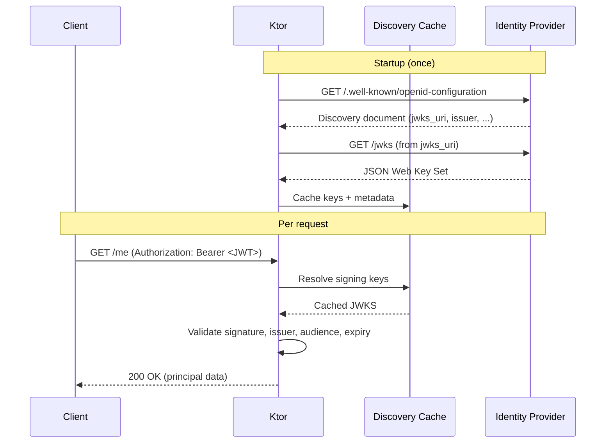
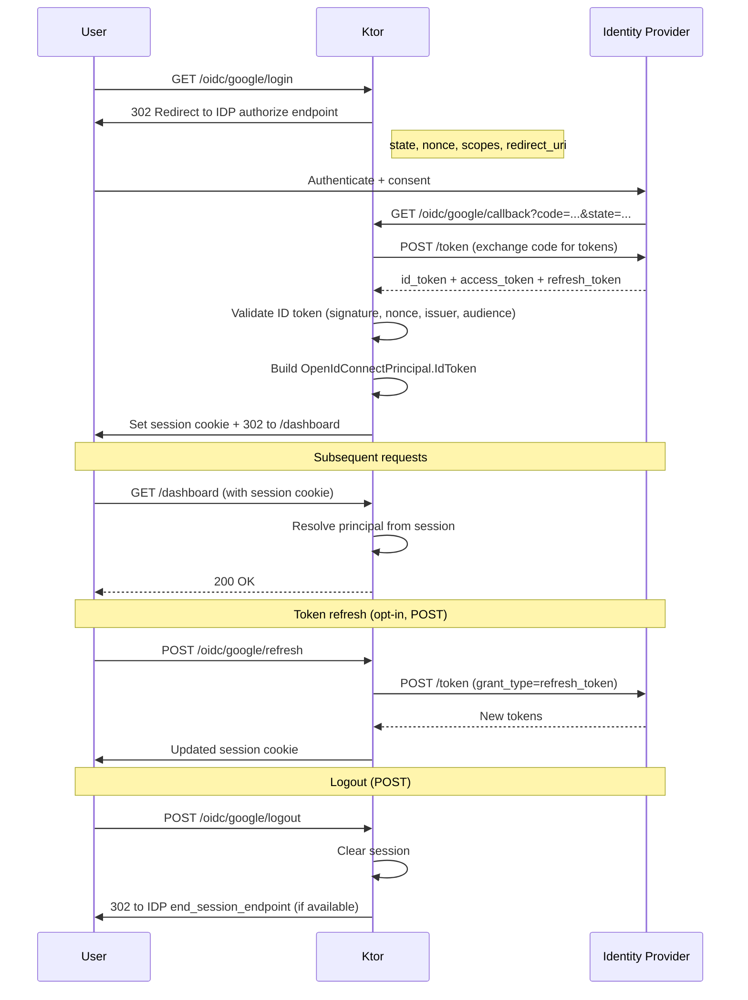

|             |                                                                     |
| ----------- | ------------------------------------------------------------------- |
| Feature     | OpenID Connect Plugin for Ktor                                      |
| Submitted   | 2026-03-23                                                          |
| Accepted    | No                                                                  |
| Issue       | https://youtrack.jetbrains.com/issue/KTOR-9266/Improve-Auth-in-Ktor |
| Preceded by | [0006-auth-3.5](0006-auth-3.5.md)                                   |
| Followed by |                                                                     |

### Contents

1. [Summary](#summary)
2. [Motivation](#motivation)
3. [The Problem Today](#the-problem-today)
4. [Packages](#packages)
5. [User Journey: Resource Server](#user-journey-resource-server)
6. [User Journey: Web Login](#user-journey-web-login)
7. [Configuration (HOCON)](#configuration-hocon)
8. [Protected Resource Metadata and Resource Indicators](#protected-resource-metadata-and-resource-indicators)
9. [Technical Details](#technical-details)
10. [Typesafe Auth Integration (KLIP 0006)](#typesafe-auth-integration-klip-0006)
11. [Ktor-Defined vs User-Defined](#ktor-defined-vs-user-defined)
12. [Advantages](#advantages)
13. [Drawbacks](#drawbacks)
14. [Open Questions](#open-questions)
15. [Future Directions](#future-directions)

<hr />

# Summary

OpenID Connect support is added through `install(OpenIdConnect) { }` in a new
`ktor-server-auth-openid` module. The plugin handles discovery, JWT validation,
OAuth login flows, session management, and protected resource metadata — giving
developers a single entry point for OIDC instead of manual wiring across
multiple Ktor modules.

# Motivation

1. **OIDC wiring is repetitive and error-prone.** Every project that integrates
   with an OpenID provider must fetch discovery documents, resolve JWK endpoints,
   configure JWT validation, and wire up OAuth callbacks. This boilerplate is
   duplicated across teams and easy to get wrong.
2. **Callback and session flows are re-implemented from scratch.** Login,
   redirect, token refresh, and logout follow well-defined patterns, yet every
   project builds its own routing and session plumbing.
3. **No standard way to advertise resource metadata.** With MCP and machine-to-
   machine OAuth becoming common, servers need to publish what authorization
   servers they trust (RFC 9728) and clients need to request properly-scoped
   tokens (RFC 8707). Ktor provides no built-in support for either.

# The Problem Today

### Manual Discovery and JWK Setup

Setting up a resource server requires fetching the discovery document, extracting
the `jwks_uri`, configuring the JWT verifier, and wiring it into the
`Authentication` plugin — all by hand:

```kotlin
val config = httpClient.fetchOpenIdConfiguration("https://accounts.google.com")

install(Authentication) {
    jwt("google-jwt") {
        validate { credential -> userService.fromSub(credential.subject) }
        jwk {
            openIdConfig = config
            audience = "my-client-id"
        }
    }
}
```

If discovery changes (key rotation, new endpoints), the application must handle
refresh logic manually or restart.

### Manual OAuth Callback Wiring

Web login requires configuring the OAuth provider, setting up redirect/callback
routes, handling the token exchange, validating the ID token, creating a session,
and managing the session cookie — spread across `Authentication`, `Sessions`, and
`Routing` configuration:

```kotlin
install(Authentication) {
    oauth("google-oauth") {
        urlProvider = { "https://myapp.com/callback" }
        providerLookup = {
            OAuthServerSettings.OAuth2ServerSettings(
                name = "google",
                authorizeUrl = "https://accounts.google.com/o/oauth2/auth",
                accessTokenUrl = "https://oauth2.googleapis.com/token",
                clientId = System.getenv("GOOGLE_CLIENT_ID"),
                clientSecret = System.getenv("GOOGLE_CLIENT_SECRET"),
                defaultScopes = listOf("openid", "profile", "email"),
            )
        }
    }
}

install(Sessions) {
    cookie<OAuthSession>("OAUTH_SESSION") { /* cookie config */ }
}

routing {
    authenticate("google-oauth") {
        get("/login") { /* Ktor redirects to Google */ }
        get("/callback") {
            val principal = call.principal<OAuthAccessTokenResponse.OAuth2>()!!
            // manually validate ID token, extract user info, create session...
        }
    }
}
```

The developer must know the authorization and token endpoint URLs (or fetch them
from discovery), handle the state parameter, validate the ID token signature, and
set up session storage — all of which the plugin should handle.

# Packages

```kotlin
dependencies {
    // New module — the OpenID Connect plugin.
    // Provides install(OpenIdConnect), provider DSL, discovery, OAuth flow routes,
    // session wiring, and protected resource metadata.
    implementation("io.ktor:ktor-server-auth-openid:$ktorVersion")

    // Existing module — used under the hood for JWT verification.
    // Pulled in transitively; listed here for clarity.
    implementation("io.ktor:ktor-server-auth-jwt:$ktorVersion")

    // Existing modules — underlying auth provider primitives and session mechanics.
    // Also transitive dependencies of ktor-server-auth-openid.
    implementation("io.ktor:ktor-server-auth:$ktorVersion")
    implementation("io.ktor:ktor-server-sessions:$ktorVersion")
}
```

# User Journey: Resource Server

This track is for API-only applications that validate incoming JWTs issued by an
OpenID provider. No login UI, no sessions — just token verification.



## Step 1 — Add Dependencies

```kotlin
dependencies {
    implementation("io.ktor:ktor-server-auth-openid:$ktorVersion")
}
```

## Step 2 — Configure the Provider

Provide the issuer and audience. The plugin fetches the discovery document and
resolves `jwks_uri` automatically:

```kotlin
fun Application.security() {
    install(OpenIdConnect) {
        provider("google") {
            issuer = "https://accounts.google.com"
            audiences = listOf("my-app-client-id")
        }
    }
}
```

## Step 3 — Protect Routes

Use the provider name in `authenticate(...)` to guard routes:

```kotlin
fun Application.module() {
    routing {
        authenticate("google") {
            get("/me") {
                val principal = call.principal<OpenIdConnectPrincipal.AccessToken>()!!
                call.respond(principal.userInfo?.subject)
            }
        }
    }
}
```

### Ktor-Defined

- Discovery document fetch and `jwks_uri` resolution at startup
- JWT provider registration in the `Authentication` plugin
- Automatic key refresh on the configured `discoveryRefreshInterval`
- Startup failure when required discovery cannot be completed

### User-Defined

- Issuer URL and audience
- Provider name (used in `authenticate(...)`)
- Principal mapping and validation logic
- Route-level authentication policy

# User Journey: Web Login

This track is for web applications that need a full OAuth2/OIDC login flow with
user-facing consent, session cookies, token refresh, and logout.



## Step 1 — Configure the Provider

Provide issuer, client credentials, and scopes. The plugin resolves all
endpoints from the discovery document:

```kotlin
fun Application.security() {
    install(OpenIdConnect) {
        httpClient = myHttpClient                  // optional: shared HTTP client
        discoveryRefreshInterval = 15.minutes      // optional: set to ZERO to disable

        provider("google") {
            issuer = "https://accounts.google.com"
            clientId = System.getenv("GOOGLE_CLIENT_ID")
            clientSecret = System.getenv("GOOGLE_CLIENT_SECRET")
        }
    }
}
```

## Step 2 — Configure JWK Verification (Optional)

When protecting API routes in the same application (hybrid mode), configure JWT
verification within the provider:

```kotlin
provider("google") {
    issuer = "https://accounts.google.com"
    clientId = System.getenv("GOOGLE_CLIENT_ID")
    clientSecret = System.getenv("GOOGLE_CLIENT_SECRET")

    jwk {
        audiences = setOf("my-api")
        clockSkewSeconds = 60

        transformPrincipal = { call, principal ->
            when (principal) {
                is OpenIdConnectPrincipal.IdToken -> MyUser(principal.userInfo.subject)
                is OpenIdConnectPrincipal.AccessToken -> MyUser(principal.userInfo?.subject ?: "unknown")
                is OpenIdConnectPrincipal.OpaqueToken -> fetchMyUserByToken(principal.token)
            }
        }

        tokenSources = {
            authorizationHeader() // default
            session()
            custom { call -> call.request.cookies["MY_TOKEN"] }
        }
    }
}
```

## Step 3 — Configure Sessions

Sessions are not enabled by default. Add a `sessions { }` block to opt in.
When sessions are enabled, CSRF protection via `originMatchesHost()` is active
by default — the plugin verifies the `Origin` header matches the server's host
on state-changing requests (POST), blocking cross-origin form submissions and
fetch calls.

```kotlin
provider("google") {
    // ...credentials from Step 1...

    sessions {
        name = "GOOGLE_SESSION"
        cookie {
            cookie.secure = true
            cookie.httpOnly = true
            cookie.extensions["SameSite"] = "lax"
        }
        csrfProtection {
            originMatchesHost()
        }
    }
}
```

## Step 4 — Configure the OAuth Flow

Define scopes, route paths, and success/failure callbacks. Routes follow the
pattern `/oidc/{providerName}/{action}` by default. Login and callback are GET
routes; refresh and logout are **POST routes** protected by the session's CSRF
origin check:

```kotlin
provider("google") {
    // ...credentials and session from above...

    oauth {
        scopes = listOf("openid", "profile", "email")

        // Resource indicators (RFC 8707) for multi-audience tokens.
        resourceIndicators = listOf("https://api.example.com")

        // Default pattern: /oidc/{providerName}/{action} — set null to disable.
        loginUri = { path("oidc", "google", "login") }       // GET
        redirectUri = { path("oidc", "google", "callback") }  // GET
        logoutUri = { path("oidc", "google", "logout") }      // POST
        refreshUri = { path("oidc", "google", "refresh") }    // POST

        onSuccess { principal ->
            call.respondRedirect("/dashboard")
        }

        onFailure {
            call.respond(HttpStatusCode.Unauthorized)
        }
    }
}
```

## Step 5 — Token Refresh (Opt-in)

When `refreshUri` is configured, the plugin installs a **POST** route that
exchanges the stored refresh token for new tokens and updates the session.
No custom code needed — the plugin handles the grant, validates the new tokens,
and updates the session cookie.

## Step 6 — Logout

When `logoutUri` is configured, the plugin installs a **POST** route that clears
the local session and, if the provider's discovery document includes an
`end_session_endpoint`, redirects the user to the provider's logout page. POST
is required because logout is a state-changing operation; combined with
`SameSite=Lax` and origin validation, this prevents cross-site logout attacks.

## Protect Routes

```kotlin
fun Application.module() {
    routing {
        authenticate("google") {
            get("/me") {
                val user = call.principal<OpenIdConnectPrincipal.IdToken>()!!
                call.respond(user.userInfo)
            }
        }
    }
}
```

### Ktor-Defined

- OAuth callback wiring and authorization code exchange
- ID token validation (signature, nonce, issuer, audience)
- Session infrastructure hookup and cookie management
- Default lifecycle behavior for login, callback, refresh, and logout routes
- State parameter generation and verification
- CSRF protection via origin header validation when sessions are enabled
- Refresh and logout routes are POST-only by default

### User-Defined

- Client credentials and scopes
- Route paths (or use defaults)
- Session and cookie policy
- CSRF protection strategy (default: `originMatchesHost()`)
- Success/failure callback business logic
- Whether refresh and logout routes are installed

# Configuration (HOCON)

Providers can be loaded from `application.conf` (or equivalent) instead of — or
in addition to — the Kotlin DSL:

```hocon
ktor.openid.google {
    issuer = "https://accounts.google.com"
    clientId = ${GOOGLE_CLIENT_ID}
    clientSecret = ${GOOGLE_CLIENT_SECRET}
    scopes = ["openid", "profile", "email"]
}

ktor.openid.github {
    issuer = "https://github.com"
    clientId = ${GITHUB_CLIENT_ID}
    clientSecret = ${GITHUB_CLIENT_SECRET}
    scopes = ["read:user", "user:email"]
}
```

Values from HOCON are merged with the DSL configuration, allowing secrets to
live in environment variables while structural settings stay in code.

# Protected Resource Metadata and Resource Indicators

This section covers two complementary RFCs that enable machine-to-machine OAuth
and are essential for protocols like MCP (Model Context Protocol).

## RFC 9728 — Protected Resource Metadata

[RFC 9728](https://www.rfc-editor.org/rfc/rfc9728) defines a standard way for a
resource server to advertise its authorization requirements. The server publishes
a JSON document at `/.well-known/oauth-protected-resource` describing which
authorization servers it trusts, what scopes it supports, and what bearer methods
it accepts.

The plugin serves this metadata automatically when `protectedResource` is
configured:

```kotlin
install(OpenIdConnect) {
    provider("google") { /* ... */ }

    protectedResource {
        resource = "https://api.example.com"
        resourceName = "My API"
        // Auto-derived from configured providers when null:
        //   authorizationServers, scopesSupported, bearerMethodsSupported
    }
}
```

This produces a `/.well-known/oauth-protected-resource` endpoint and adds
`resource_metadata` to `WWW-Authenticate` headers on 401 responses, allowing
clients to discover authentication requirements dynamically.

## RFC 8707 — Resource Indicators

[RFC 8707](https://www.rfc-editor.org/rfc/rfc8707) allows OAuth clients to
specify *which resource* they need an access token for when requesting
authorization. This is the `resource` parameter in the authorization and token
requests.

In the plugin, resource indicators are configured per-provider in the OAuth flow:

```kotlin
oauth {
    scopes = listOf("openid", "profile")
    resourceIndicators = listOf("https://api.example.com")
}
```

# Technical Details

## Principal Shape

```kotlin
abstract class OpenIdConnectPrincipal {
    abstract val refreshToken: String?

    @Serializable
    class IdToken(
        public val idToken: String,
        public val accessToken: String? = null,
        override val refreshToken: String? = null,
        public val userInfo: UserInfo,
    ) : OpenIdConnectPrincipal() {
        public val idTokenClaims: TokenClaims
        public val accessTokenClaims: TokenClaims?
    }

    @Serializable
    public class AccessToken(
        public val accessToken: String,
        public val userInfo: UserInfo? = null,
        override val refreshToken: String? = null,
    ) : OpenIdConnectPrincipal() {
        public val accessTokenClaims: TokenClaims
    }

    @Serializable
    public class OpaqueToken(
        public val token: String,
        override val refreshToken: String? = null,
    ) : OpenIdConnectPrincipal()

    @Serializable
    public class UserInfo(
        public val subject: String,
        public val name: String? = null,
        public val email: String? = null,
        public val emailVerified: Boolean? = null,
        public val picture: String? = null,
        public val givenName: String? = null,
        public val familyName: String? = null,
        public val preferredUsername: String? = null,
    )
}

class TokenClaims { ... }
```

The principal type depends on the authentication path:

- **`IdToken`** — returned from a full OIDC login flow (contains both tokens and
  verified user info)
- **`AccessToken`** — returned when validating a JWT Bearer token on a resource
  server (user info may be absent)
- **`OpaqueToken`** — returned when the token is not a JWT (requires
  introspection or external resolution)

## Discovery Lifecycle

1. **Startup:** Discovery is launched in `Application.coroutineScope` when the
   plugin is installed. The application blocks during startup until all providers
   have completed initial discovery.
2. **Refresh:** The discovery document and JWKS are re-fetched on the configured
   `discoveryRefreshInterval` (default: 15 minutes). Set to `Duration.ZERO` to
   disable periodic refresh.
3. **HTTP client:** A custom `HttpClient` can be provided for discovery requests
   (proxy configuration, custom TLS, logging).
4. **Failure:** If initial discovery fails, the application fails to start. If a
   refresh fails after startup, the plugin continues with the previously cached
   data and retries on the next interval.

## Module Ownership

- **`ktor-server-auth-openid`** — plugin DSL, discovery, provider/session
  orchestration, OAuth flow route wiring, protected resource metadata
- **`ktor-server-auth`** — underlying auth provider primitives (used by plugin
  wiring)
- **`ktor-server-auth-jwt`** — JWT verification and JWK support (used under the
  hood)
- **`ktor-server-sessions`** — session storage and cookie mechanics

# Typesafe Auth Integration (KLIP 0006)

When used alongside `ktor-server-typesafe-auth`
([KLIP 0006](0006-auth-3.5.md)), the OpenID Connect provider can produce a typed
`AuthScheme` for use with `authenticateWith(...)`:

```kotlin
install(OpenIdConnect) {
    provider("google") {
        issuer = "https://accounts.google.com"
        audience = "my-app-client-id"
    }
}

val GoogleAuth = createAuthScheme<OpenIdConnectPrincipal.AccessToken>("google")

routing {
    authenticateWith(GoogleAuth) {
        get("/me") {
            call.respond(principal.userInfo?.subject)
        }
    }
}
```

This gives you compile-time principal safety (non-null, correctly typed) on top
of the OpenID Connect plugin's discovery and validation infrastructure. Role-
based and anonymous extensions from KLIP 0006 (`withRoles`, `orAnonymous`) apply
as usual.

# Ktor-Defined vs User-Defined

## Ktor-Defined

- Discovery workflow and automatic JWKS resolution
- Provider and session orchestration at startup
- OAuth route wiring (login and callback as GET; refresh and logout as POST)
- ID token and access token validation (signature, claims)
- State/nonce generation and verification for the OAuth flow
- CSRF protection
- Protected resource metadata endpoint (RFC 9728)
- Authentication evaluation order in hybrid (bearer + session) mode
- Secure session cookie defaults (`Secure`, `HttpOnly`, `SameSite=Lax`)

## User-Defined

- Provider configuration (issuer, audience, client credentials)
- Endpoint paths (or use default `/oidc/{provider}/{action}` pattern)
- Scopes and resource indicators
- Session and cookie policy overrides
- Principal mapping via `transformPrincipal`
- Callback business logic (`onSuccess`, `onFailure`)
- Route-level authentication policy
- Whether refresh/logout routes are installed

# Advantages

1. **Less OIDC/OAuth integration boilerplate.** Discovery, JWK resolution, token
   exchange, and ID token validation are handled by the plugin. A minimal
   resource server requires only issuer and audience.
2. **Consistent baseline for secure session/callback configuration.** Session
   cookies default to `Secure`, `HttpOnly`, `SameSite=Lax`. CSRF protection
   via origin validation is enabled by default when sessions are configured.
   State and nonce parameters are managed automatically.
3. **Clear extension points for app-specific behavior.** Principal mapping,
   callbacks, session policy, and route paths are all customizable without
   forking the flow.
4. **Standards-compliant resource metadata out of the box.** RFC 9728 and
   RFC 8707 support enables machine-to-machine OAuth patterns, including MCP
   server authentication.
5. **MCP-ready server configuration.** A Ktor server can advertise its
   authorization requirements to MCP clients with a single `protectedResource`
   block.

# Drawbacks

1. **Implicit plugin defaults may surprise teams preferring explicit wiring.**
   Auto-generated routes and session hookup reduce boilerplate but can be opaque
   to developers expecting full control.
2. **Hybrid mode can increase operational complexity.** Supporting both bearer
   tokens and session cookies in the same provider requires understanding token
   source priority and session lifecycle.
3. **Provider-specific edge cases still require custom code.** The plugin covers
   standard OIDC flows; provider quirks (non-standard claims, extra parameters)
   need `transformPrincipal` or `extraParameters`.
4. **Dependency on discovery availability at startup.** The application will not
   start if the identity provider's discovery endpoint is unreachable.

# Open Questions

1. **Auto-generated routes: default or opt-in?** Should login/logout/refresh
   routes be installed automatically when `oauth { }` is configured, or should
   each route require explicit opt-in via `loginUri`, `logoutUri`, `refreshUri`?
2. **Typesafe scheme production.** How should `OpenIdConnect` integrate with
   KLIP 0006's `AuthScheme<P>` — should installing a provider automatically
   produce a typed scheme, or should developers create one explicitly via
   `createAuthScheme<P>(name)`?
3. **PKCE default behavior.** Should PKCE (Proof Key for Code Exchange) be
   enabled by default for all OAuth flows, or only when no `clientSecret` is
   provided (public clients)?
4. **Provider-specific extensions.** How to handle parameters like Google's `hd`
   (hosted domain) or Azure's `tenant` — explicit DSL properties per provider,
   or a generic `extraParameters` map?
5. **Discovery refresh failure.** What happens when periodic discovery refresh
   fails after a successful startup — graceful degradation with stale cached
   data (current design), or propagate the error to incoming requests?
6. **CSRF protection strategies.** Should `csrfProtection` support additional
   strategies beyond `originMatchesHost()` — for example, a double-submit
   cookie for clients that cannot rely on the `Origin` header?
7. **How to apply CSRF?** Should we check it inside of `jwt.verify`(preffered) or traverse the routing tree before the application starts and apply the CSRF plugin whenever `authenticate("google")` is used?

# Future Directions

The following ideas are **not part of this proposal**. They describe possible
extensions that stay consistent with the plugin's architecture.

## 1. PKCE and Additional Grant Types

PKCE (RFC 7636) adds code verifier/challenge to the authorization code flow,
preventing interception attacks. Beyond the authorization code grant, the plugin
could support device code flow (RFC 8628) for CLI/IoT applications and client
credentials grant (RFC 6749 Section 4.4) for service-to-service authentication.

## 2. Back-Channel Logout

The [OpenID Connect Back-Channel Logout](https://openid.net/specs/openid-connect-backchannel-1_0.html)
specification enables identity providers to notify resource servers when a user's
session should be terminated. The plugin could expose a configurable logout
endpoint that receives and validates logout tokens, then invalidates the
corresponding local session.

## 3. Dynamic Client Registration (RFC 7591)

[RFC 7591](https://www.rfc-editor.org/rfc/rfc7591) allows OAuth clients to
register with an authorization server at runtime. This is important for MCP,
where MCP clients need to register dynamically with authorization servers they
have not been pre-configured with. The plugin could support both server-side
(receiving registrations) and client-side (registering with external servers)
flows.

## 4. DPoP — Demonstrating Proof of Possession (RFC 9449)

[RFC 9449](https://www.rfc-editor.org/rfc/rfc9449) binds access tokens to a
specific client key pair, preventing token theft and replay. The plugin could
generate DPoP proofs for outgoing token requests and validate incoming DPoP-bound
tokens on resource server routes.

## 5. Telemetry and Observability Hooks

Metrics for discovery fetch latency, token exchange success/failure rates, JWT
validation errors, and session lifecycle events. These could integrate with
Ktor's existing metrics infrastructure or expose callbacks for custom telemetry
pipelines.
