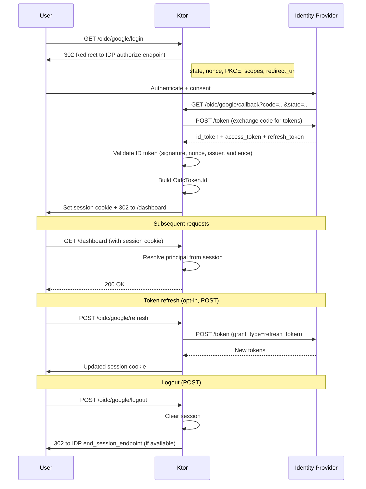

|             |                                                                     |
|-------------|---------------------------------------------------------------------|
| Feature     | OpenID Connect Plugin for Ktor                                      |
| Submitted   | 2026-03-23                                                          |
| Accepted    | Yes                                                                 |
| Issue       | https://youtrack.jetbrains.com/issue/KTOR-9266/Improve-Auth-in-Ktor |
| Preceded by | [0006-auth-3.5](0006-auth-3.5.md)                                   |
| Followed by |                                                                     |

### Contents

1. [Summary](#summary)
2. [Motivation](#motivation)
3. [The Problem Today](#the-problem-today)
4. [Packages](#packages)
5. [User Journey: Resource Server](#user-journey-resource-server)
6. [User Journey: Web Login](#user-journey-web-login)
7. [Configuration (HOCON)](#configuration-hocon)
8. [Protected Resource Metadata and Resource Indicators](#protected-resource-metadata-and-resource-indicators)
9. [Technical Details](#technical-details)
10. [Typesafe Auth Integration (KLIP 0006)](#typesafe-auth-integration-klip-0006)
11. [Rejected Alternatives](#rejected-alternatives)
12. [Ktor-Defined vs User-Defined](#ktor-defined-vs-user-defined)
13. [Advantages](#advantages)
14. [Drawbacks](#drawbacks)
15. [Open Questions](#open-questions)
16. [Future Directions](#future-directions)

<hr />

# Summary

OpenID Connect support is added through `install(Oidc)` in a new `ktor-server-auth-oidc` module. The plugin handles
discovery, JWT and introspection Bearer authentication, OAuth authorization-code login with PKCE, session management,
and protected resource metadata — a single entry point instead of manual wiring across multiple Ktor modules.

Providers are registered with the suspend `identityProvider` call. That returns typed schemes from
[KLIP 0006](0006-auth-3.5.md) (`jwtBearer`, `introspectionBearer`, `session`) for use with `authenticateWith`. Map token
principals to application types with `mapPrincipal`.

# Motivation

1. **OIDC wiring is repetitive and error-prone.** Every project that integrates with an OpenID provider must fetch
   discovery documents, resolve JWK endpoints, configure JWT validation, and wire up OAuth callbacks. This boilerplate
   is duplicated across teams and easy to get wrong.
2. **Callback and session flows are re-implemented from scratch.** Login, redirect, token refresh, and logout follow
   well-defined patterns, yet every project builds its own routing and session plumbing.
3. **No standard way to advertise resource metadata.** With MCP and machine-to- machine OAuth becoming common, servers
   need to publish what authorization servers they trust (RFC 9728) and clients need to request properly-scoped tokens
   (RFC 8707). Ktor provides no built-in support for either.

# The Problem Today

### Manual Discovery and JWK Setup

Setting up a resource server requires fetching the discovery document, extracting the `jwks_uri`, configuring the JWT
verifier, and wiring it into the
`Authentication` plugin — all by hand:

```kotlin
val config = httpClient.fetchOpenIdConfiguration("https://accounts.google.com")

install(Authentication) {
    jwt("google-jwt") {
        validate { credential -> userService.fromSub(credential.subject) }
        jwk {
            openIdConfig = config
            audience = "my-client-id"
        }
    }
}
```

If discovery changes (key rotation, new endpoints), the application must handle refresh logic manually or restart.

### Manual OAuth Callback Wiring

Web login requires configuring the OAuth provider, setting up redirect/callback routes, handling the token exchange,
validating the ID token, creating a session, and managing the session cookie — spread across `Authentication`,
`Sessions`, and
`Routing` configuration:

```kotlin
install(Authentication) {
    oauth("google-oauth") {
        urlProvider = { "https://myapp.com/callback" }
        providerLookup = {
            OAuthServerSettings.OAuth2ServerSettings(
                name = "google",
                authorizeUrl = "https://accounts.google.com/o/oauth2/auth",
                accessTokenUrl = "https://oauth2.googleapis.com/token",
                clientId = System.getenv("GOOGLE_CLIENT_ID"),
                clientSecret = System.getenv("GOOGLE_CLIENT_SECRET"),
                defaultScopes = listOf("openid", "profile", "email"),
            )
        }
    }
}

install(Sessions) {
    cookie<OAuthSession>("OAUTH_SESSION") { /* cookie config */ }
}

routing {
    authenticate("google-oauth") {
        get("/login") { /* Ktor redirects to Google */ }
        get("/callback") {
            val principal = call.principal<OAuthAccessTokenResponse.OAuth2>()!!
            // manually validate ID token, extract user info, create session...
        }
    }
}
```

The developer must know the authorization and token endpoint URLs (or fetch them from discovery), handle the state
parameter, validate the ID token signature, and set up session storage — all of which the plugin should handle.

# Packages

```kotlin
dependencies {
    // New module — the OpenID Connect plugin.
    // Provides install(Oidc), identityProvider, discovery, OAuth login/callback,
    // session wiring, Bearer schemes, and protected resource metadata.
    implementation("io.ktor:ktor-server-auth-oidc:$ktorVersion")
}
```

`authenticateWith` is `@ExperimentalKtorApi` and uses Kotlin context parameters. Opt in when protecting OIDC routes with
typed schemes.

# User Journey: Resource Server

This track is for API-only applications that validate incoming JWTs issued by an OpenID provider. No login UI, no
sessions — just token verification.


## Step 1 — Add Dependencies

```kotlin
dependencies {
    implementation("io.ktor:ktor-server-auth-oidc:$ktorVersion")
}
```

## Step 2 — Register the Identity Provider

`identityProvider` is suspend because it performs initial discovery. Call it from a suspend application module. Provide
the issuer and at least one Bearer audience. The plugin fetches the discovery document and resolves `jwks_uri`
automatically:

```kotlin
suspend fun Application.security() {
    val oidc = install(Oidc)

    val google = oidc.identityProvider("google") {
        issuer = "https://accounts.google.com"
        bearer {
            audience = setOf("my-app-client-id")
        }
    }
}
```

Optional JWT config live in `jwt { }` (clock skew, allowed algorithms, JWK cache/rate-limit). They are
shared by ID-token and JWT access-token validation.

## Step 3 — Protect Routes

`jwtBearer` is a typed scheme whose principal is `OidcToken.Access`. Use `authenticateWith` (KLIP 0006). Map to an
application principal when you do not want to expose token material on the route:

```kotlin
data class AppUser(val id: String)

suspend fun Application.module() {
    val oidc = install(Oidc)
    val google = oidc.identityProvider("google") {
        issuer = "https://accounts.google.com"
        bearer {
            audience = setOf("my-app-client-id")
        }
    }
    val apiUser = google.jwtBearer.mapPrincipal { token ->
        val id = token.claims.subject ?: return@mapPrincipal null
        AppUser(id)
    }

    routing {
        authenticateWith(apiUser) {
            get("/me") {
                val user = call.principal
                call.respond(user.id)
            }
        }
    }
}
```

Without `mapPrincipal`, `call.principal` is `OidcToken.Access` (`value`, `claims`, optional `userInfo`).

### Opaque tokens — `introspectionBearer`

Nested `introspection { }` enables a second scheme that sends any presented access token to RFC 7662, whether
JWT-formatted or opaque:

```kotlin
val google = oidc.identityProvider("google") {
    issuer = "https://accounts.google.com"
    bearer {
        audience = setOf("my-api")
        introspection {
            endpoint = "https://accounts.google.com/oauth/introspect"
            clientId = "api-client"
            clientSecret = "..."
        }
    }
}

routing {
    authenticateWith(google.introspectionBearer) {
        get("/api/opaque") { 
            val token = call.principal // OidcToken.Introspected
            val introspection = token.introspection // TokenIntrospection
            call.respond("Hello ${introspection.username ?: "Unknown"}!")
        }
    }
}
```

JWT Bearer and introspection Bearer are independent schemes. Protect each route with the one you need.

### Ktor-Defined

- Discovery document fetch and `jwks_uri` resolution during `identityProvider` registration
- Typed `jwtBearer` / `introspectionBearer` schemes
- Periodic metadata refresh on `discoveryRefreshInterval`
- Registration failure (`OpenIdDiscoveryException`) when initial discovery cannot complete

### User-Defined

- Issuer URL and Bearer audience
- Provider name (used in generated scheme names and default routes)
- Principal mapping via `mapPrincipal`
- Optional custom `tokenExtractor` (default: `Authorization: Bearer`)
- Route-level authentication policy (`authenticateWith`)

# User Journey: Web Login

This track is for web applications that need a full OAuth 2.0 / OIDC login flow with user-facing consent, session
cookies, token refresh, and logout.



## Step 1 — Configure OAuth on the Provider

Provide issuer and OAuth client credentials. Endpoints come from discovery. Login and callback routes are always
installed with `oauth { }` (defaults `/oidc/{name}/login` and `/oidc/{name}/callback`). Browser sessions are **enabled
by default**; customize with `sessions { }` or opt out with
`disableSessions()`.

PKCE uses `S256` by default. Set `codeChallengeMethod = null` only for legacy providers that reject PKCE. The `openid`
scope is required. The callback requires an ID token.

```kotlin
suspend fun Application.security() {
    val oidc = install(Oidc) {
        httpClient = myHttpClient                  // optional: shared HTTP client
        discoveryRefreshInterval = 15.minutes      // optional: set to ZERO to disable
    }

    val google = oidc.identityProvider("google") {
        issuer = "https://accounts.google.com"
        oauth {
            clientId = System.getenv("GOOGLE_CLIENT_ID")
            clientSecret = System.getenv("GOOGLE_CLIENT_SECRET")
            scopes = listOf("openid", "profile", "email")

            onAuthenticated { token ->
                call.respondRedirect("/dashboard")
            }
        }
    }
}
```

## Step 2 — Customize Sessions (Optional)

When `oauth { }` is configured and `disableSessions()` is not called, sessions are on. The default cookie name is
`{NAME}_SESSION` (provider name uppercased). Secure defaults are `httpOnly`, `secure`
in production, and `SameSite=lax`. CSRF protection uses `originMatchesHost()` by default.

```kotlin
oauth {
    clientId = System.getenv("GOOGLE_CLIENT_ID")
    clientSecret = System.getenv("GOOGLE_CLIENT_SECRET")

    sessions {
        name = "GOOGLE_SESSION"
        cookie {
            cookie.secure = true
        }
        csrfProtection {
            originMatchesHost()
        }
        // tokenRefreshStrategy = OidcTokenRefreshStrategy.Auto(beforeExpiry = 30.seconds)
    }
}
```

Call `disableCsrfProtection()` to turn CSRF off. CSRF applies to plugin-managed POST routes (refresh, logout) and to
non-safe methods under `authenticateWith(provider.session)`.

`disableSessions()` selects callback-only handling. Plugin-managed `logout { }` / `refresh { }` then cannot be used, and
`onAuthenticated { }` is required, so verified token material is not discarded.

## Step 3 — Optional Login Paths, Refresh, and Logout

Override `loginUri` / `redirectUri` when the default `/oidc/{name}/...` paths do not fit.
`logout { }` and `refresh { }` are **opt-in**. Calling them without a path uses
`POST /oidc/{name}/logout` and `POST /oidc/{name}/refresh`. Both require sessions.

```kotlin
oauth {
    clientId = System.getenv("GOOGLE_CLIENT_ID")
    clientSecret = System.getenv("GOOGLE_CLIENT_SECRET")
    resourceIndicators = listOf("https://api.example.com")

    loginUri = { path("oidc", "google", "login") }
    redirectUri = { path("oidc", "google", "callback") }

    onAuthenticated { token ->
        call.respondRedirect("/dashboard")
    }
    onAuthenticationFailed {
        call.respond(HttpStatusCode.Unauthorized)
    }

    refresh { /* POST /oidc/google/refresh */ }
    logout(
        postLogoutRedirectUri = { path("logged-out") },
    )
}
```

Refresh exchanges the stored refresh token, validates new tokens, and updates the session cookie. Logout clears the
local session and, when discovery includes `end_session_endpoint`, redirects to the provider. POST plus `SameSite=Lax`
and origin validation prevent cross-site logout.

Automatic per-request session refresh is a separate `sessions { tokenRefreshStrategy }` setting (`Disabled` by default;
expired ID-token sessions are still rejected on user routes).

## Protect Routes

`session` is a typed session scheme whose principal (and session value) is `OidcToken.Id`:

```kotlin
data class AppUser(val id: String)

suspend fun Application.module() {
    val oidc = install(Oidc)
    val google = oidc.identityProvider("google") {
        issuer = "https://accounts.google.com"
        oauth {
            clientId = System.getenv("GOOGLE_CLIENT_ID")
            clientSecret = System.getenv("GOOGLE_CLIENT_SECRET")
            onAuthenticated { call.respondRedirect("/dashboard") }
        }
    }
    val userSession = google.session.mapPrincipal { token ->
        AppUser(id = token.userInfo.subject)
    }

    routing {
        authenticateWith(userSession) {
            get("/me") {
                val user = call.principal
                call.respond(user.id)
            }
        }
    }
}
```

Without `mapPrincipal`, `call.principal` and `call.session` are `OidcToken.Id`. Mapping runs when a derived scheme
authenticates a route, never during the OAuth callback.

The same `identityProvider` can also configure `bearer { }` for API routes (`jwtBearer` /
`introspectionBearer`) alongside web login.

### Ktor-Defined

- OAuth callback wiring and authorization code exchange (KLIP 0006 `oauth2` / `oauth2Session`)
- ID token validation (signature, nonce, issuer, audience = OAuth `clientId`)
- PKCE `S256` unless disabled
- Session cookie defaults and CSRF `originMatchesHost()` when sessions are enabled
- Encrypted OAuth state cookie (`state`, `nonce`, PKCE verifier)
- Login and callback GET routes; opt-in refresh and logout POST routes

### User-Defined

- Client credentials and scopes (`openid` required)
- Route paths (or use `/oidc/{provider}/{action}` defaults)
- Session and cookie policy; CSRF strategy or `disableCsrfProtection()`
- `onAuthenticated` / `onAuthenticationFailed` business logic
- Whether `refresh { }` / `logout { }` are installed
- Optional `fetchUserInfo`, `resourceIndicators`, `stateEncryptionKey`

# Configuration (HOCON)

Provider values can be stored in `application.conf` (or equivalent) and applied **explicitly** with
`OidcEnvConfig`. The plugin does **not** merge HOCON into the DSL:

```hocon
ktor.oidc.google {
    issuer = "https://accounts.google.com"
    clientId = ${GOOGLE_CLIENT_ID}
    clientSecret = ${GOOGLE_CLIENT_SECRET}
    scopes = ["openid", "profile", "email"]
}
```

```kotlin
val env = environment.config
    .property("ktor.oidc.google")
    .getAs<OidcEnvConfig>()

val oidc = install(Oidc)
val google = oidc.identityProvider("google") {
    issuer = env.issuer
    bearer {
        audience = setOf("api")
    }
    oauth {
        clientId = env.clientId
        clientSecret = env.clientSecret
        scopes = env.scopes // must include openid; assigning replaces the OAuth default list
    }
}
```

# Protected Resource Metadata and Resource Indicators

This section covers two complementary RFCs that enable machine-to-machine OAuth and are essential for protocols like MCP
(Model Context Protocol).

## RFC 9728 — Protected Resource Metadata

[RFC 9728](https://www.rfc-editor.org/rfc/rfc9728) defines a standard way for a resource server to advertise its
authorization requirements. The server publishes a JSON document at `/.well-known/oauth-protected-resource` describing
which authorization servers it trusts, what scopes it supports, and what bearer methods it accepts.

The plugin serves this metadata when `protectedResource` is configured. The resource identifier is the function
argument:

```kotlin
val oidc = install(Oidc) {
    protectedResource("https://api.example.com") {
        resourceName = "My API"
        // Auto-derived from providers configured with bearer { } when null:
        //   authorizationServers, scopesSupported, bearerMethodsSupported
    }
}
```

This produces a `/.well-known/oauth-protected-resource` endpoint and adds `resource_metadata` to
`WWW-Authenticate` headers on Bearer authentication failures.

## RFC 8707 — Resource Indicators

[RFC 8707](https://www.rfc-editor.org/rfc/rfc8707) allows OAuth clients to specify *which resource* they need an access
token for when requesting authorization. This is the `resource` parameter in the authorization and token requests.

In the plugin, resource indicators are configured per-provider in the OAuth flow:

```kotlin
oauth {
    scopes = listOf("openid", "profile")
    resourceIndicators = listOf("https://api.example.com")
}
```

# Technical Details

## Token Shape

Route-facing schemes expose precise `OidcToken` subtypes. Constructors for token-bearing subclasses are internal so
applications cannot fabricate a verified principal.

```kotlin
interface OidcToken {
    @Serializable
    class Id(
        val value: String,          // verified ID token
        val accessToken: String,    // accompanying access token; not a Bearer principal
        val refreshToken: String? = null,
        val userInfo: UserInfo,
    ) : OidcToken {
        val claims: TokenClaims     // decoded from value; access does not re-verify
    }

    @Serializable
    class Access(
        val value: String,          // verified JWT access token
        val userInfo: UserInfo? = null,
    ) : OidcToken {
        val claims: TokenClaims
        val clientId: String?       // azp, else client_id
    }

    @Serializable
    class Introspected(
        val value: String,
        val introspection: TokenIntrospection,
    ) : OidcToken

    @Serializable
    class UserInfo(
        val subject: String,
        val name: String? = null,
        val email: String? = null,
        val emailVerified: Boolean? = null,
        val picture: String? = null,
        val givenName: String? = null,
        val familyName: String? = null,
        val preferredUsername: String? = null,
    )
}
```

The principal type depends on the scheme:

- **`OidcToken.Id`** — OAuth callback and `provider.session`. The accompanying `accessToken` string is not verified as a
  resource-server Bearer principal; use `jwtBearer` for `OidcToken.Access`.
- **`OidcToken.Access`** — `provider.jwtBearer` after local JWT verification against `bearer { audience }`.
- **`OidcToken.Introspected`** — `provider.introspectionBearer` after RFC 7662 (JWT or opaque).

## Discovery Lifecycle

1. **Registration:** Initial discovery runs inside suspend `identityProvider`. It blocks that call until metadata is
   loaded or `initialDiscoveryAttempts` (default 1) is exhausted, then fails with
   `OpenIdDiscoveryException`. Retry delay is `initialDiscoveryRetryDelay` (default 5 seconds). Discovery work runs on
   `Dispatchers.IO`.
2. **Refresh:** After success, metadata is re-fetched on `discoveryRefreshInterval` (default 15 minutes)
   unless static `metadata` is set or the interval is `Duration.ZERO`. Failed refreshes keep the last successful
   document, emit `OidcMetadataRefreshFailed`, and retry after `discoveryRefreshFailureDelay`
   (default 1 minute).
3. **HTTP client:** A custom `HttpClient` can be provided on `install(Oidc)` for discovery and userinfo (proxy, TLS,
   logging). Otherwise, the plugin installs an internal client and closes it on
   `ApplicationStopped`.
4. **Static metadata / tests:** Set `metadata = OpenIdProviderMetadata(...)` to skip discovery and periodic refresh.
   `jwt(OpenIdTestKeys)` verifies signatures against in-memory keys.

Provider names must match `[a-z0-9]+(?:-[a-z0-9]+)*`. Duplicate names or issuers fail registration.

## Module Ownership

- **`ktor-server-auth-oidc`** — plugin DSL, discovery, provider/session orchestration, OAuth route wiring, Bearer
  schemes, protected resource metadata
- **`ktor-server-auth`** — typed `authenticateWith` / `mapPrincipal` (KLIP 0006)

Implicit and Hybrid flows are not supported. Authorization Code with PKCE is the login flow.

# Typesafe Auth Integration (KLIP 0006)

The plugin produces typed schemes on `OidcProvider`. There is no separate `createAuthScheme` step and no
`ktor-server-typesafe-auth` module:

| Scheme                | Principal                | When available                          |
|-----------------------|--------------------------|-----------------------------------------|
| `jwtBearer`           | `OidcToken.Access`       | `bearer { }`                            |
| `introspectionBearer` | `OidcToken.Introspected` | `bearer { introspection { } }`          |
| `session`             | `OidcToken.Id`           | `oauth { }` without `disableSessions()` |

```kotlin
val google = oidc.identityProvider("google") {
    issuer = "https://accounts.google.com"
    bearer { audience = setOf("my-app-client-id") }
}

val apiUser = google.jwtBearer.mapPrincipal { token ->
    AppUser(id = token.claims.subject ?: return@mapPrincipal null)
}

routing {
    authenticateWith(apiUser) {
        get("/me") {
            call.respond(call.principal.id)
        }
    }
}
```

`withRoles` and `orAnonymous` from KLIP 0006 apply to these schemes as usual. Domain `mapPrincipal`
runs only when the derived scheme authenticates a protected route, not during the OAuth callback.

# Rejected Alternatives

These were considered in earlier drafts of this KLIP and are **not** part of the implemented API.

**`install(OpenIdConnect) { provider("google") { ... } }`.** Providers are not nested inside plugin install.
`install(Oidc)` returns a registry; `identityProvider` is a separate suspend call so discovery can complete before the
typed schemes are used.

**Untyped `authenticate("google")` as the primary route API.** Each capability is its own scheme (`jwtBearer`,
`introspectionBearer`, `session`) used with `authenticateWith`. A single provider name does not mix Bearer and session
principals on one route.

**`transformPrincipal` / `tokenSources` on a shared JWK block.** Principal mapping is `mapPrincipal`
on the scheme that authenticates the route. Bearer token location is `bearer { tokenExtractor }`
(default `Authorization: Bearer`), not a list of session-plus-header sources on JWT config.

**Sessions opt-in at provider root.** Sessions are nested under `oauth { }` and enabled by default for that flow. Opt
out with `disableSessions()`.

**Automatic HOCON merge (`ktor.openid.*`).** Environment values are `ktor.oidc.*` via `OidcEnvConfig`, applied
explicitly in the DSL.

**`OpenIdConnectPrincipal` / `OpaqueToken`.** Token principals are `OidcToken.Id`, `OidcToken.Access`, and
`OidcToken.Introspected`. Introspection is a distinct scheme, not an opaque variant of a shared principal hierarchy with
a `refreshToken` on every subtype.

# Ktor-Defined vs User-Defined

## Ktor-Defined

- Discovery workflow and automatic JWKS resolution
- Typed schemes on `OidcProvider`
- OAuth route wiring (login and callback as GET; refresh and logout as POST when opted in)
- ID token and JWT access token validation (signature, claims)
- PKCE `S256` unless disabled
- State/nonce generation and encrypted state cookie
- CSRF protection on session-authenticated non-safe methods and plugin POST routes
- Protected resource metadata endpoint (RFC 9728)
- Secure session cookie defaults (`Secure` in production, `HttpOnly`, `SameSite=Lax`)

## User-Defined

- Provider configuration (issuer, Bearer audience, client credentials)
- Endpoint paths (or use default `/oidc/{provider}/{action}` pattern)
- Scopes and resource indicators
- Session and cookie policy overrides
- Principal mapping via `mapPrincipal`
- Callback business logic (`onAuthenticated`, `onAuthenticationFailed`)
- Route-level authentication policy (`authenticateWith`)
- Whether refresh/logout routes are installed
- HOCON values applied explicitly through `OidcEnvConfig`

# Advantages

1. **Less OIDC/OAuth integration boilerplate.** Discovery, JWK resolution, token exchange, and ID token validation are
   handled by the plugin. A minimal resource server requires only issuer and Bearer audience.
2. **Consistent baseline for secure session/callback configuration.** Session cookies default to `HttpOnly`, `Secure` in
   production, `SameSite=Lax`. CSRF protection via origin validation is enabled by default when sessions are on. PKCE,
   state, and nonce are managed automatically.
3. **Clear extension points for app-specific behavior.** Principal mapping, callbacks, session policy, and route paths
   are customizable without forking the flow.
4. **Standards-compliant resource metadata out of the box.** RFC 9728 and RFC 8707 support enables machine-to-machine
   OAuth patterns, including MCP server authentication.
5. **Compile-time principal safety.** Each scheme exposes one `OidcToken` subtype;
   `mapPrincipal` and `authenticateWith` (KLIP 0006) keep application types non-null on protected routes.

# Drawbacks

1. **Implicit plugin defaults may surprise teams preferring explicit wiring.**
   Auto-generated login/callback routes and default sessions reduce boilerplate but can be opaque to developers
   expecting full control.
2. **Hybrid apps still need two schemes.** Bearer and session on the same issuer are separate `authenticateWith` trees
   (`jwtBearer` vs `session`), not one provider name with token-source priority.
3. **Provider-specific edge cases still require custom code.** The plugin covers standard OIDC flows; provider quirks
   (non-standard claims, extra authorize parameters) need `mapPrincipal` or are not yet expressible in the DSL.
4. **Discovery availability blocks provider registration.** `identityProvider`
   fails after exhausted initial attempts if the discovery endpoint is unreachable. The rest of the application can
   still start; that provider's schemes are not available.

# Open Questions

1. **Provider-specific extensions.** How to handle parameters like Google's `hd`
   (hosted domain) or Azure's `tenant` — explicit DSL properties per provider, or a generic `extraParameters` map?

# Future Directions

The following ideas are **not part of this proposal**. They describe possible extensions that stay consistent with the
plugin's architecture.

## 1. Additional Grant Types

Beyond authorization code, the plugin could support device code flow (RFC 8628)
for CLI/IoT applications and client credentials grant (RFC 6749 Section 4.4) for service-to-service authentication.

## 2. Back-Channel Logout

The [OpenID Connect Back-Channel Logout](https://openid.net/specs/openid-connect-backchannel-1_0.html)
specification enables identity providers to notify resource servers when a user's session should be terminated. The
plugin could expose a configurable logout endpoint that receives and validates logout tokens, then invalidates the
corresponding local session.

## 3. Dynamic Client Registration (RFC 7591)

[RFC 7591](https://www.rfc-editor.org/rfc/rfc7591) allows OAuth clients to register with an authorization server at
runtime. This is important for MCP, where MCP clients need to register dynamically with authorization servers they have
not been pre-configured with. The plugin could support both server-side (receiving registrations) and client-side
(registering with external servers)
flows.

## 4. DPoP — Demonstrating Proof of Possession (RFC 9449)

[RFC 9449](https://www.rfc-editor.org/rfc/rfc9449) binds access tokens to a specific client key pair, preventing token
theft and replay. The plugin could generate DPoP proofs for outgoing token requests and validate incoming DPoP-bound
tokens on resource server routes.

## 5. Telemetry and Observability Hooks

Metrics for discovery fetch latency, token exchange success/failure rates, JWT validation errors, and session lifecycle
events. These could integrate with Ktor's existing metrics infrastructure or expose callbacks for custom telemetry
pipelines.
