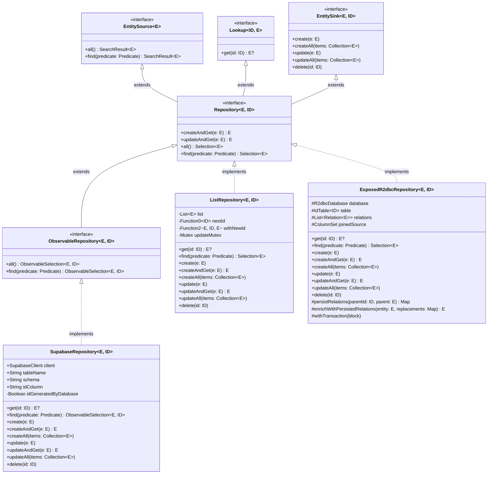

|           |                                                 |
|-----------|-------------------------------------------------|
| Feature   | Repository API                                  |
| Submitted | 2026-07-29                                      |
| Accepted  | No                                              |
| Issue     | https://youtrack.jetbrains.com/issue/KTOR-9692/ |
| Prototype | https://github.com/bjhham/ktor-data             |

### Contents

1. [Summary](#summary)
2. [Motivation](#motivation)
3. [Current Solutions](#current-solutions)
4. [Design Overview](#design-overview)
5. [Design Details](#design-details)
6. [Drawbacks](#drawbacks)
7. [Advantages](#advantages)
8. [Open Questions](#open-questions)
9. [Future Directions](#future-directions)

<hr />

# Summary
[summary]: #summary

This document details the design of an asynchronous repository abstraction for bridging data access and serializable classes. 

# Motivation
[motivation]: #motivation

The most common standard for managing application data over HTTP is the REST API.  In the transport-agnostic abstraction 
of this standard, engineers might refer to the services behind these endpoints as _CRUD repositories_.  As indicated by 
the acronym, each repository handles operations for _creation_, _reading_, _updating_, and _deleting_.

If we define an interface that describes the function of this repository, it follows that it can be harnessed to 
implement REST endpoints over the entire stack of an application.  That is, in the implementation of the back end 
operations onto the database, and in the client in calls to the REST endpoints.  

For our needs in Ktor, we are often at a disadvantage when comparing our persistence abstractions to more advanced 
systems like Spring Data.  Our recommended solution involves using the lightweight Exposed ORM for reading from the 
database and translating the rows to serializable types through custom functions.  As I'll show in our design, this 
creates quite a lot of boilerplate and tight coupling that can be avoided by the introduction of this newly proposed
repository abstraction layer.

# Current Solutions
[current-solutions]: #current-solutions

## Spring Data

[Spring Data](https://spring.io/projects/spring-data) is a well-known library for the server persistence layer.  It greatly reduces the amount of boilerplate 
JPA code, albeit at the cost of some introspection.  Instead of implementing the `CrudRepository` interface, developers
can simply extend it.  Adding their own interface methods by the documented convention, they can introduce type-safe
queries.

For example:
```java
interface UserRepository extends JpaRepository<User, UUID> {
    Optional<User> findByEmail(String email);
}
```

Spring Data can generate the implementation for this interface based on the annotations in `User`.  This abstraction can 
be reused for virtually any database connection, so long as the schema is available and the data types are supported.
These interfaces are also easy to fake or mock, so the actual persistence layer is not required during testing. 

This paradigm can also be problematic at times.  When the query is embedded in a function name, then the number of 
combinations can quickly explode.  Furthermore, abstractions can't be built on these complex interfaces, effectively 
making it only a portal to some opaque generated code that is closed for extension.  The hidden nature of the SQL can 
also create performance risks when issuing many subqueries for connected entities.  The framework also relies heavily 
on annotations and reflection, which can either leak into your domain model, or be the source of duplication.

## Room

Google's [Room](https://developer.android.com/topic/libraries/architecture/room) persistence library is a popular choice for 
Android applications. It provides a simple and efficient way to interact with SQLite databases. Room abstracts away the 
complexities of SQLite and provides a type-safe API for accessing and manipulating data. It also supports data migration 
and database versioning, making it easier to manage changes to the database schema.

The library provides a custom set of annotations, similar to JPA entity annotations.

Here is an example from the [Room documentation](https://developer.android.com/topic/libraries/architecture/room#kotlin):

```kotlin
@Entity(tableName = "users")
data class User(
    @PrimaryKey val uid: Int,
    @ColumnInfo(name = "first_name") val firstName: String?,
    @ColumnInfo(name = "last_name") val lastName: String?
)
```

They provide a similar approach to querying and manipulation as Spring Data, but leveraging Kotlin's type system and suspend functions.

Here is the example of a DAO from their documentation:

```kotlin
@Dao
interface UserDao {
    @Query("SELECT * FROM user")
    suspend fun getAll(): List<User>

    @Query("SELECT * FROM user WHERE uid IN (:userIds)")
    suspend fun loadAllByIds(userIds: IntArray): List<User>

    @Query(
        """
        SELECT * FROM user
        WHERE first_name LIKE :first AND last_name LIKE :last LIMIT 1
        """
    )
    suspend fun findByName(first: String, last: String): User

    @Insert
    suspend fun insertAll(vararg users: User)

    @Delete
    suspend fun delete(user: User)
}
```

This is another good example of mapping entity types to Kotlin types, but it follows a similar pattern to Spring Data,
relying heavily on annotations and code generation for querying data.  It is also unsuitable as an abstraction over 
REST or GraphQL endpoints.

# Design Overview
[design-overview]: #design-overview

For a proper Kotlin persistence interop layer, we need an abstraction that meets the following requirements:

**Core behavior**
- Provides standard CRUD operations using suspend functions
- Includes an exhaustive query model for expressive, type-safe matching

**Compatibility**
- Agnostic of the persistence layer, with support for Exposed and kotlinx-serialization
- Compatible with both REST and GraphQL transports

**Developer experience**
- Ships an in-memory implementation for use in testing
- Requires no reflection or annotations

# Design Details
[design-details]: #design-details

To address the absence of the framework, we should introduce a standalone library that contains all the abstractions 
and interfaces.  These would include `Repository`, `Identifiable`, `Predicate`, and other relevant types.  Then, we'll 
have adapter libraries for Exposed, kotlinx-serialization, Ktor, and so on.

So the library structure would look something like this:

```
/ktor-data: interfaces and abstractions
  /ktor-data-serialization: serialization support
  /ktor-data-exposed: exposed adapter
  /ktor-data-server: tools for query parsing, etc.
```

And here is the design of the `Repository` interface as it currently stands:

```kotlin
/**
 * A generic repository interface for managing entities that implement the Identifiable interface.
 *
 * @param E The type of the entity to be managed. Must extend Identifiable with the given ID type.
 * @param ID The type of the identifier for the entities being managed.
 */
interface Repository<E, in ID> : EntitySource<E>, Lookup<ID, E>, EntitySink<E, ID> {
    suspend fun createAndGet(e: E): E
    suspend fun updateAndGet(e: E): E
    override fun all(): Selection<E> = find(Predicate.Everything)
    override fun find(predicate: Predicate): Selection<E>
}

/**
 * A generic interface for creating and updating entities.
 * 
 * All methods in this interface only consume.  This allows for fire-and-forget operations.
 *
 * @param E The type of the entity to be managed.
 */
interface EntitySink<in E, in ID> {
    suspend fun create(e: E)
    suspend fun createAll(items: Collection<E>)
    suspend fun update(e: E)
    suspend fun updateAll(items: Collection<E>)
    suspend fun delete(id: ID)
}

/**
 * Interface for querying entities.
 *
 * @param E The type of entities being queried, constrained to types that implement [Identifiable].
 */
interface EntitySource<out E> {
    fun all(): SearchResult<E> = find(Everything)
    fun find(predicate: Predicate): SearchResult<E>
}

/**
 * Basic read-only search result.
 */
interface SearchResult<out E> {
    suspend fun list(): List<E>
    suspend fun page(limit: UInt? = null, offset: UInt? = null): Page<E>
}

/**
 * Represents a mutable selection of entities from a repository.
 *
 * The processing is deferred to the chained suspend calls for deriving the result list, page, updates or deletes.
 *
 * @param E the expected entity type
 */
interface Selection<out E>: SearchResult<E> {
    suspend fun patchAll(values: FieldValues)
    suspend fun deleteAll()
    suspend fun single(): E
    suspend fun count(): UInt
}

typealias FieldValues = Map<Field<*>, Any?>

/**
 * List wrapper for a limited view of a larger source of data.
 *
 * @property total The total number of items available for this view
 */
interface Page<out E>: List<E> {
    val total: UInt
}

/**
 * A generic interface for retrieving entities by their unique identifiers.
 *
 * @param ID The type of the unique identifier used to locate an entity.
 * @param E The type of the entity to be returned.
 */
interface Lookup<in ID, out E> {
    suspend fun get(id: ID): E?
}
```

And the general usage would look something like this:

```kotlin
val examples = ListRepository<Example>()
val first = examples.createAndGet(Example(name = "First"))
val second = examples.createAndGet(Example(name = "Second"))
assertEquals(listOf(first, second), examples.all().list())

val updated = first.copy(name = "Updated")
examples.update(updated)
assertEquals(updated, examples.get(first.id))

examples.delete(second.id)
assertEquals(listOf(updated), examples.all().list())
```

For the sake of brevity, we only show a small part of the API here.

You can find a full implementation along with tests in [the experimental prototype](https://github.com/bjhham/ktor-data).  
In this prototype, you'll find the core in-memory repository and adapters for Exposed R2DBC and Supabase.

The key selling point of this abstraction is that we can clients can be developed independently of the back end by 
using local persistence that implements the same interfaces.  This should improve the development experience 
of Kotlin in general by narrowing the deployment overhead of building applications in Compose, which would apply for 
human and AI developers alike.

For reference, here is a class diagram including the prototype implementations:




# Drawbacks
[drawbacks]: #drawbacks

- These abstractions provide a nice way to avoid duplication when mapping from the persistence layer to serializable 
  types. However, by introducing an extra layer, this could lead to some inflexibility and a loss of mastery over the 
  lower level implementations.
- The API does not provide a means for transactions, so these actions must be done in the persistence layer.
- It is meant to work for a broad scope of implementations, so there will be significant maintenance overhead.
- The library will probably need to remain experimental for some time until we can prototype the different implementations.

# Advantages
[advantages]: #advantages

- The abstraction will provide looser coupling and good fakes for testing.
- This library will fill a big gap in the Kotlin ecosystem for asynchronous data access.
- We can easily integrate Ktor's authentication and other plugins for communicating with back ends.

# Open Questions
[open-questions]: #open-questions

- We don't have clear solutions for:
  - Column selection and ad-hoc types
  - Custom joins, views
  - Transactions
- GraphQL support needs further exploration.
- Should this library be part of Ktor, or a standalone library?

# Future Directions
[future-directions]: #future-directions

- Fully dynamic lists in Compose applications.
- Support for dynamic entity types (rows), and GraphQL implementation.